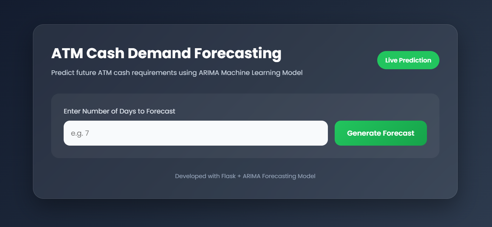
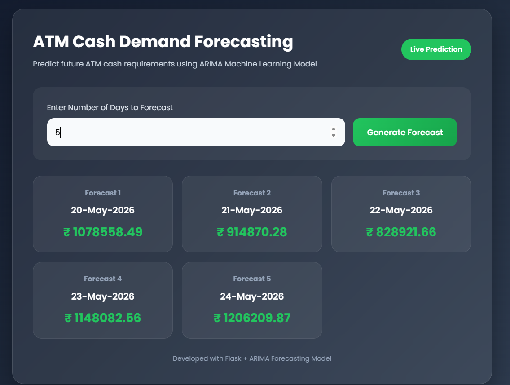
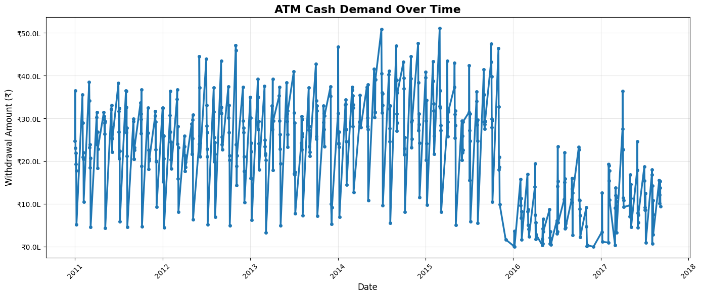
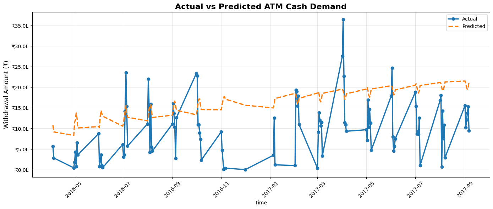

# 🏧 ATM Cash Demand Forecasting System

An AI-powered ATM Cash Demand Forecasting system built using Flask and ARIMA Time Series Forecasting to predict future ATM cash withdrawal requirements for efficient cash management and replenishment planning.

---

## 🚀 Features

- 📈 Time series cash demand forecasting
- 🤖 ARIMA-based prediction model
- 💰 Forecast future ATM withdrawal amounts
- 📅 Multi-day forecasting support
- ⚡ Real-time prediction generation
- 🎨 Modern responsive glassmorphism UI
- 📊 Data visualization and analytics
- 🧠 Machine Learning powered forecasting

---

## 🛠️ Tech Stack

### Frontend
- HTML5
- CSS3
- JavaScript

### Backend
- Python
- Flask

### Machine Learning / Forecasting
- ARIMA
- Statsmodels
- Pandas
- NumPy
- Scikit-learn
- Matplotlib

---

## 🧠 Forecasting Model

### Algorithm Used
- ARIMA (AutoRegressive Integrated Moving Average)

### Model Configuration

:contentReference[oaicite:0]{index=0}

### Forecasting Objective
Predict future ATM cash withdrawal demand using historical transaction data.

---

## 📂 Project Structure

```bash
ATM-Cash-Demand-Forecasting/
│
├── templates/
│   └── index.html
│
├── atm_data.csv
├── atm_arima.ipynb
├── atm_cash_forecast_model.pkl
├── app.py
├── requirements.txt
├── README.md
└── screenshots/
```

---

## 📊 Dataset Information

The dataset contains:

- ATM Name
- Weekday Information
- Working Day / Holiday
- Festival Information
- Transaction Date
- Total Amount Withdrawn

### Target Variable
- `total_amount_withdrawn`

---

## ⚙️ Model Training Workflow

1. Load ATM transaction dataset
2. Perform data preprocessing
3. Create datetime index
4. Aggregate daily withdrawals
5. Train ARIMA forecasting model
6. Evaluate forecasting performance
7. Save trained model using Joblib

---

## 📈 Model Performance

| Metric | Value |
|---|---|
| MAE | 820,577.30 |
| RMSE | 955,057.44 |

---

## 🔄 Application Workflow

1. User enters forecast days
2. Flask receives request
3. ARIMA model generates forecast
4. Future dates created dynamically
5. Forecasted ATM cash demand displayed

---

## 📸 Screenshots

### 🖥️ Dashboard

<p align="center">
  
</p>

---

### 📊 Forecast Results

<p align="center">
  
</p>

---

### 📈 ATM Demand Visualization

<p align="center">
  
</p>

---

### 🤖 Model Training

<p align="center">
  
</p>

---

## ▶️ Installation

### 1️⃣ Clone Repository

```bash
git clone https://github.com/KaranBisht111/ATM-Cash-Demand-Forecasting.git
```

---

### 2️⃣ Navigate to Project Folder

```bash
cd ATM-Cash-Demand-Forecasting
```

---

### 3️⃣ Install Dependencies

```bash
pip install -r requirements.txt
```

---

### 4️⃣ Run Flask Application

```bash
python app.py
```

---

## 🌐 Access Application

Open browser:

```bash
http://127.0.0.1:5000
```

---

## 📦 Requirements

Main dependencies:

- Flask
- Pandas
- NumPy
- Statsmodels
- Matplotlib
- Scikit-learn
- Joblib

---

## 📊 Visualization & Analysis

The project includes:

- ATM withdrawal trend analysis
- Actual vs Predicted comparison
- Forecast visualization
- Time series analytics

---

## 🔮 Future Improvements

- LSTM forecasting model
- Multi-ATM prediction support
- Real-time banking integration
- Dashboard analytics
- Holiday-aware forecasting
- Seasonal ARIMA (SARIMA)
- Prophet forecasting
- Cloud deployment

---

## 📚 Learning Outcomes

This project demonstrates:

- Time Series Forecasting
- ARIMA implementation
- Financial analytics
- Flask deployment
- Forecast visualization
- Data preprocessing
- Predictive analytics

---

## 🔐 Business Benefits

- Optimized ATM cash replenishment
- Reduced cash shortages
- Improved operational efficiency
- Better financial planning
- Lower maintenance costs

---

## 👨‍💻 Author

Karan Bisht

---

## ⭐ Support

If you found this project useful, give it a star ⭐ on GitHub.

---

## 📜 License

This project is licensed under the MIT License.